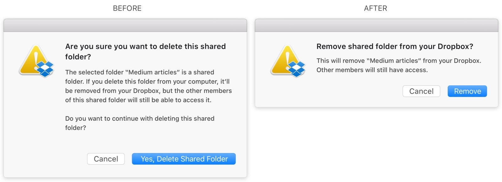

There are a few things that developers can do that can improve the overall user experience in an application; he/she may not need to take a UX course to learn.

However, when passed unnoticed can damage the application’s experience; on the other hand, if you spend some time and correct them, it can improve the application's user experience significantly.

### Prove the value of your app

Imagine being asked for your ID copy/credit card before entering a shop? How would you feel? That’s how users feel when you ask for their data before they can even use your app, what I'm saying is we should Let the user do something in our apps without requiring him to sign up. It is not enough to put a splash screen or a short tutorial on how the app works to establish whether your application is worth it or not.

> “If you ask me for my data before offering any value, that means you’re more concerned with my data than with solving my problem.” Rushing User

I think the statement above sums it up. It would be best if you didn't ask for a user to sign-in or give in (his) data before even showing him why your app deserves (his) attention or data. I know some apps need to know about the user before him using it, but I think you can always figure a way to give value before you ask for it.

> Give value to your users before you ask for it.

### Prefer OAuth over traditional email-password

When a user signs up using traditional email-password, he has to memorize the password for your specific application or even worse in some cases he might re-use a password(unless he uses a password management/generator app).

Some users tend to re-use or create weak passwords for most applications they use, to avoid laborious work of memorizing or saving in a password manager. 

Having to memorize things is a pain, laborious and time consuming, usually users have many things to keep track of (tasks, family names, phone numbers), so it’s improbable that they’ll memorize your apps’ password, they have zillions of apps, you want to make your app easy to use without the hassle of remembering passwords and emails. To prevent this, you can use OAuth.

With OAuth, the user doesn’t need to memorize a password or username(in short it allows passwordless sign-in/up), signing-in or signing-up is only a “tap/click away,” meaning he only has to allow your application to access his/her data. 

This flow tends to be less laborious for the user because he/she doesn't have to memorize a password and then verify if the email was filled correctly. Using the OAuth flow implies that you don’t have to implement the logic for resetting the password(unless you have users signed-in in using email-password) that the user is likely to forget over and over again until he/she stops using your service.

By using OAuth not only you have the convenience of signing in the user in without requiring a password you also have access to the information(first name, last name, age and more) that the user has already filled in his/her account.

Whether you should use Google, Twitter, Facebook, Linkedin or GitHub OAuth provider can depend based on your needs, however, more often than not, you'll use more than one OAuth provider.

Given that Facebook and Google are the providers with the most users, I'll compare both and say why and when I'd use one over the other.

Google and Facebook allow you to get almost the same information for a given user, but using one or the other might have different user experience implications to your application.

Usually, the flow is the same/close, and you click to register or sign-in then you get redirected to a page where you can either accept, declined or accept but customize(I can only s see this feature on Facebook) what information the app can get from your account.

On mobile most specifically Android, when you sign in or sign up with Facebook, it usually opens a web browser tab which can be expensive for the user. 

Opening the browser or external apps uses RAM and processing power, which is not what you want your app to do, because most devices have low RAM, and processing power is scarce, even if they have good processing power it’s very likely that they opened dozen other apps besides yours.

Another disadvantage of opening a browser/app for signing-in/up is the loss of the attention of the user because he is taken to a different place where he might find distractions, and who knows whether he'll return?

Google has come out with some exciting features to speed up the sign flow using, for the web they created something called one tap sign-up or auto sign-in which allows seamless sign-in and sign-up flows without interrupting them with a sign-on or sign-up screen.

|  |
|:--:|
| *Google auto sign in pop up* |

|  |
|:--:|
| *Google auto sign in processing* |

On Android, Google allows users to sign-in or sign-up without having to leave the application, by showing a modal of the list of accounts that the user setup in that device and wants to use in your application.

|  |
|:--:|
| *Google android sign in: source androidhive.info* |

### Don't ask them to invite their friends nor rate you

Seriously, I don’t think users invite other people to use an app. No one does that. It’s odd and weird. If I want my friend to use this X app, I tell him to download and explain the benefits and tell him how cool I’m because I’m using it or how it has changed, improved or helped me doing Y thing. Word of mouth is the kind of invitation or recommendation that people want, not receiving a message or an email saying user X invited you to use this app, how is the app supposed to solve my problem if it’s already creating a new one by spamming me?

### Use appropriate language

Unlike other extremely formal fields like architecture and law, in software, no one will come and suspend your app because the language is not grammatically correct(there are some edge cases where the language has to follow  strictly the rules of grammar and so forth), or it used words that do not exist in the dictionary.

When building your app prefer a language that is easy to grasp and in the context. (It doesn’t have to be grammatically correct, though this is not an appeal to ignore the grammar entirely, there are tiny things you can do or change in your language to make it easier to understand to your specific users).

The inadequate use of language can cause doubt, uncertainty, hesitation, ambiguity, misinformation.

Long texts can hinder your user’s experience as in he or she might be using a mobile device which does not have a large screen.

Here are couple of examples of bad language use that resulted in confusion, misinformation:

|  |
|:--:|
| *Use of long text delaying comprehension* |

|  |
|:--:|
| *Confusing modal* |

There are a lot more other things you can do to improve user experience but I decided to focus only on these which I think when overlooked can damage your application user experience.

I hope you found something that can either be applied in your current project or upcoming projects and that you learned as much as I did writing this post, may your next/current project have the best user experience possible.

Thanks, and see you next time.
